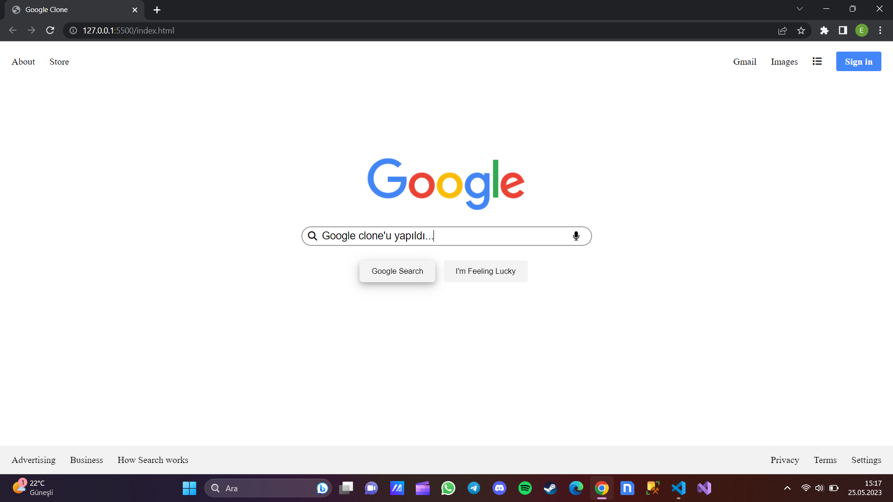

# Google Clone

HTML ve CSS kullanarak oluşturduğum Google Clone projesinin netlify'da yayınlanmış halini görmek için [tıklayınız](https://google-clone-cinci.netlify.app/).

Bu projeyi yaparken kendimi geliştirdiğim ve öğrendiğim konular ise;

* Metin biçimlendirme özelliklerini kullanabilmeyi,

* Flex özelliklerini kullanarak konumlandırma yapabilmeyi,

* not() ve hover pseudo class'larını kullanabilmeyi,

* calc() metodu ile hesaplamalar yapabilmeyi,

* box-shadow() metodu ile gölgelendirme yapabilmek.

**NOT:** Bu projede responsive tasarım yapılmamıştır.

## Projenin Görünümü

